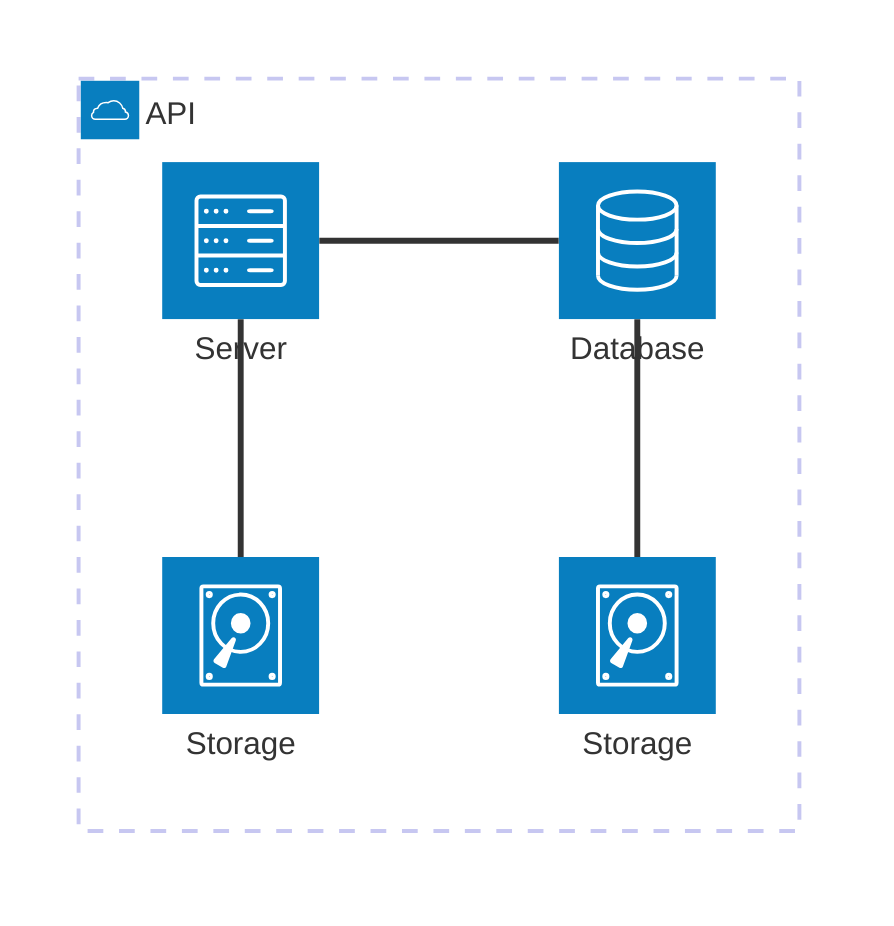

# Mermaid: Architecture

## Mermaid Code

[Mermaid Live Editor: Architecture](https://mermaid.live/edit#pako:eNqNkd9LwzAQx_-Vck8ddKNNu_7Im7oXQUHUJ9c9pM2tC65JSVNRx_53k3ZjMEHMQ-7H93OXcHeAWnEECkzXO2GwNoPGeYWGldKzp9Fq6DzWCb_eq4HP1jdP95tSTmKP-kPU6PHK58ywivU4W69O3sYT0hVeoaJ_j3x3z9YvRmnW_AGS_4DOovYnY9nRXtAJ5hV98OZz75lO3CnrPkNfnXD7SyBngVcQQKMFB2r0gAG0qFvmQjg4vASzwxZLoNbluGXD3pRQyqMt65h8U6o9V9phNjugW7bvbTR0dmq4EqzR7IKg5Kjv1CAN0IgUYw-gB_gEStJikWZZFGYRWRbJMk8C-LLpOFvkaRySjNhkkZDsGMD3-Gy4WMZFmOZxnudRTNIkDQC5sPN8nNY-bv_4A1wupJ8)

```
architecture-beta
    group api(cloud)[API]

    service db(database)[Database] in api
    service disk1(disk)[Storage] in api
    service disk2(disk)[Storage] in api
    service server(server)[Server] in api

    db:L -- R:server
    disk1:T -- B:server
    disk2:T -- B:db
```

## Mermaid Diagram


