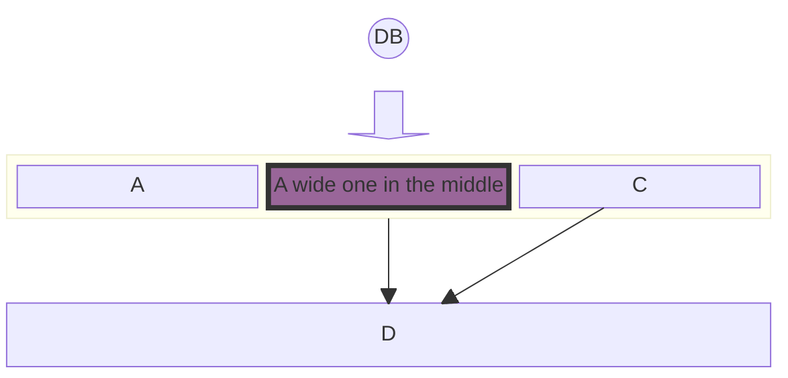

# Mermaid: Block

## Mermaid Code

[Mermaid Live Editor: Block](https://mermaid.live/edit#pako:eNpNUdFugjAU_ZXmmiyagAEKCN1iovLiw35g6x4KrUosLSkl6oz_vgJb3EvPOck5957m3qHSXACBUurq7JfCMqoqLftGdSikCiFezucUii2FxWLQo3FjjL7sefr2SeFFlV37-v-l8LWec31RzwDZFwNHaDPB1gU36FJzgbQSqFbIngRqas6lcPHJtBtAKD5A17JKDGScsy-Q768nvnvSzt6kQFt0qKUkszzNvc4afRZkhjH-5b5bak8kbq_gwdHUHIg1vfCgEaZhg4T7MIuCa9S4MsRRLg6sl5YCVQ8Xa5n60Lr5SxrdH09ADkx2TvUtZ1YUNTsa9rS4bwiz072yQKIoGmcAucMVyCpYpnmarXAcRGGOXWu4OdMqWQZxluEkzcIgCWL88OB73Or8SZhGKQ6wy2VZHHogeG21eZ-OOd708QMuTJDR)

```
block-beta
columns 1
  db(("DB"))
  blockArrowId6<["&nbsp;&nbsp;&nbsp;"]>(down)
  block:ID
    A
    B["A wide one in the middle"]
    C
  end
  space
  D
  ID --> D
  C --> D
  style B fill:#969,stroke:#333,stroke-width:4px
```

## Mermaid Diagram


