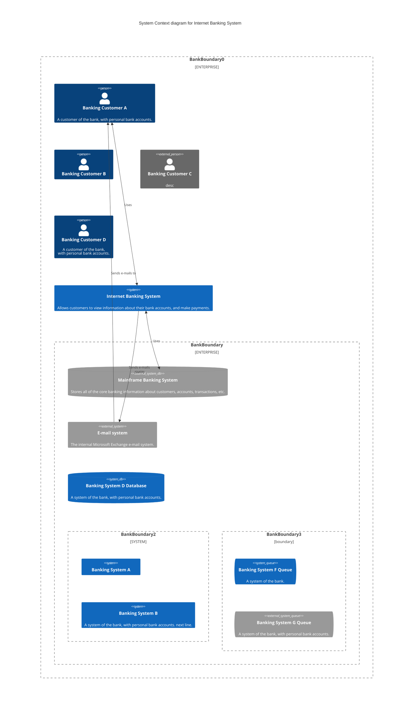

# Mermaid: C4

## Mermaid Code

[Mermaid Live Editor: C4](https://mermaid.live/edit#pako:eNqdVdFu2jAU_ZUrP3VSxtIACYumSQRotQekdu1eJqTKSQxYTWxkOyus4t_nOAkJYNpteQHb9_jc43t8_YoSnhIUoslgwpkiW7VgoD9FVUbgYScVyaFegZTilcA5LLmAb3pKMKIgwuyZslUdW6Fn5eJGUEmeIl6wFIvdVew6sEBldDPlLtAHeK0Q5XdHhOTsKimk4jkR4ya-3H1ST8J4gcr5MTRhwJeg1gRiHenAC1Vr2JiNcGbmACeJJlSyp-kukkVWssgCeZpt1QE2scImVY4pkYnZ4CLr1Aqfvi3xSyw-fX1faEtaVeaq-hmbY71UvYo4y_iLPLBLUBx-UfIClOnK51hRzgDHvFBlVlQcszuAWQo5fiawwbucWBKy2uP61B4n7miVTGNTg2owK2FzrFPTziRWPQ-KCyIBZ1lzkImeMFmXoeeqDsqdjiolMJM4KcP0iKjkVFWbYEeVd6rKs8g6L1LXF_UlHB950QqLLLCoMZOsxn99W4CVVz6jjPTOmPcXdLdlMRdj9jHHNKuZqzweNTc15tOEc5oILvlSwWybrDFbESBdyDlxY4CaZWoRPIUpVjjGkvyvcktd24L2Twvar2jiy65tE78vSEHq3G8sud-AibiceO8NExhopwS3FoLb9wj-oYPWRjj5e7BGRL-TrNvMu_3nhyTysFkV2S53LvZRnC3K-OyBsFTW1pH1nZ8_3lmAOvzoeTlC6j6nIchBK0FTFCpREAfpSL2oh8hUdYH0SeX6AEPT4Je4yNQCLdhewzaY_eQ8b5CCF6s1Cpc4k3pUbFKsyLR6QQ8hml4_IuXhotALXLMHCl_RFoWfg55_PeiPBt6wH_j-wEE7FPqjXuAGvusHo2HfG_j9vYN-G063NwqGrv483w0C1xteO4ikVLe-efXAm3d-_wc4J4fN)

[Mermaid Documentation: C4 Diagram](https://mermaid.js.org/syntax/c4.html)

```
C4Context
    title System Context diagram for Internet Banking System
    Enterprise_Boundary(b0, "BankBoundary0") {
        Person(customerA, "Banking Customer A", "A customer of the bank, with personal bank accounts.")
        Person(customerB, "Banking Customer B")
        Person_Ext(customerC, "Banking Customer C", "desc")

        Person(customerD, "Banking Customer D", "A customer of the bank, <br/> with personal bank accounts.")

        System(SystemAA, "Internet Banking System", "Allows customers to view information about their bank accounts, and make payments.")

        Enterprise_Boundary(b1, "BankBoundary") {
            SystemDb_Ext(SystemE, "Mainframe Banking System", "Stores all of the core banking information about customers, accounts, transactions, etc.")

            System_Boundary(b2, "BankBoundary2") {
                System(SystemA, "Banking System A")
                System(SystemB, "Banking System B", "A system of the bank, with personal bank accounts. next line.")
            }

            System_Ext(SystemC, "E-mail system", "The internal Microsoft Exchange e-mail system.")
            SystemDb(SystemD, "Banking System D Database", "A system of the bank, with personal bank accounts.")

            Boundary(b3, "BankBoundary3", "boundary") {
                SystemQueue(SystemF, "Banking System F Queue", "A system of the bank.")
                SystemQueue_Ext(SystemG, "Banking System G Queue", "A system of the bank, with personal bank accounts.")
            }
        }
    }

    BiRel(customerA, SystemAA, "Uses")
    BiRel(SystemAA, SystemE, "Uses")
    Rel(SystemAA, SystemC, "Sends e-mails", "SMTP")
    Rel(SystemC, customerA, "Sends e-mails to")
```

## Mermaid Diagram


