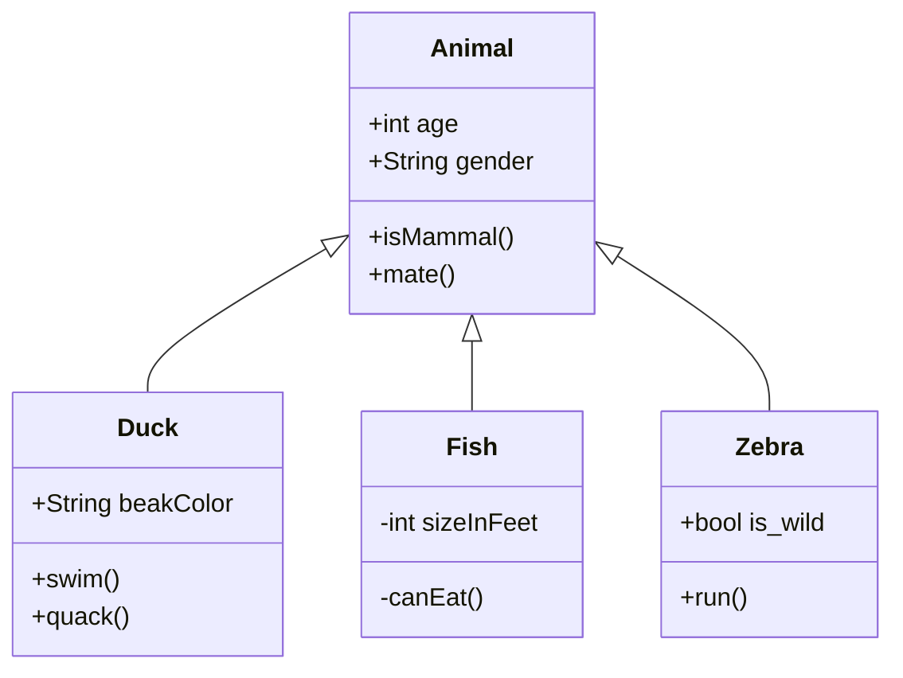

# Mermaid: Class

## Mermaid Code

[Mermaid Live Editor: Class](https://mermaid.live/edit#pako:eNptUstuwjAQ_BVrT60aUBICSa1eKihSD5x6qyJVS2KCRWxTP0QL5d_rpCSl0L14Z9YzXq99gEKVDCgUNRoz41hpFLkkPh4lF1iTh6_BgMxcsblm59ysr9lXttT4h6bkjktLsGKX9IvVXFakYrJk-rzYSMwChU9vbi8KAi3ryLbttr3DD0F60yXDzVTVSvcFs-OiE3r47rDYdPh47tdcrPcbNL0bvmfPcs6Y7ekC5RPaf_XtCH4bWipVE27edrwue1I72WshgErzEqjVjgUgmBbYQGg9crBrJlgO1KclW6GrbQ65bGRblK9KiU6plavWQFdYG4_ctvSjOj1qv6Wd9VQ5aYFGSdp6AD3AB9B0NMyibDJKxmEWRckkCeATaBIOozi5z-I4HGVZPI6TYwD79tRwmKXj0Ec8CdM09LUAWMmt0ovTt2qW4zdg_bc7)

```
mermaid
classDiagram
    Animal <|-- Duck
    Animal <|-- Fish
    Animal <|-- Zebra
    Animal : +int age
    Animal : +String gender
    Animal: +isMammal()
    Animal: +mate()
    class Duck{
      +String beakColor
      +swim()
      +quack()
    }
    class Fish{
      -int sizeInFeet
      -canEat()
    }
    class Zebra{
      +bool is_wild
      +run()
    }
```

## Mermaid Diagram


