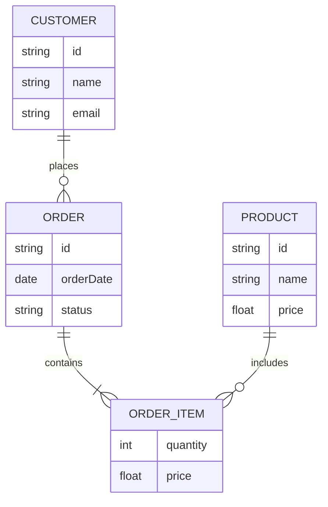

# Mermaid: Entity Relationship

## Mermaid Code

[Mermaid Live Editor: Entity Relationship](https://mermaid.live/edit#pako:eNqdUrFugzAQ_RXr5mTs4hUydEBUlCwVUnXCB7EENjXnoYL8e00MUSKkDL3p7und8_PTTVBbRSCBXKqxddhXRoRKzp9lnp0KMc_Ho51EXqRhkGLosKYxciK2EOaV8P1enrLAqq1h1GblfRR5ek7KJ6mNqU3debUp3l-d4rzUyE6bVmi1gwz2tAOpR91F9Ppo87WiQiZhnQophG5HHRnZj0-q26f-4bTpLLIYnK5pbzQG86CqDYsfj4Y1_77SgAO0TiuQ7DwdoCcXkggj3LQq4AsFEyBDq6hB33EFlVnWBjRf1vbbprO-vYBssBvD5Iclm_U27hQyIarEesMg3w5ASrN1Wbyk20Fd_wAAi7XX)

```
erDiagram
    CUSTOMER ||--o{ ORDER : places
    ORDER ||--|{ ORDER_ITEM : contains
    PRODUCT ||--o{ ORDER_ITEM : includes
    CUSTOMER {
        string id
        string name
        string email
    }
    ORDER {
        string id
        date orderDate
        string status
    }
    PRODUCT {
        string id
        string name
        float price
    }
    ORDER_ITEM {
        int quantity
        float price
    }
```

## Mermaid Diagram


