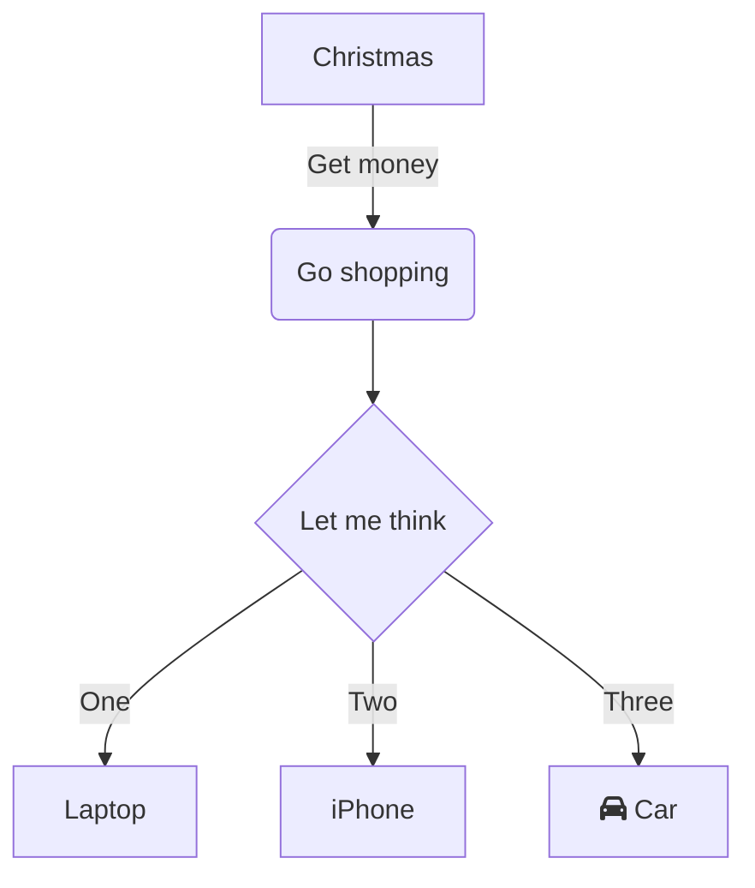

# Mermaid: Flowchart

## Mermaid Code

[Mermaid Live Editor: Flowchart](https://mermaid.live/edit#pako:eNpVkUFPg0AQhf_KZk6a0GbZQpE9mFiqvdTowZPQw6YMLLHskmVJrcB_d6HR6Jxm5r3vzWF6OOocgUNx0uejFMaSt22miKuHNJGmam0t2gNZLO6HHVpSa4WXgWxudpq0UjdNpcrbq38zmUjS7ycbEisr9TFepWTmXxQOZJvuRWN1c_irvJ31QB7T6lW6-P-KNOiop7QQvBCLozAkEeYAHpSmyoFb06EHNZpaTCP0E5yBlVhjBty1ORaiO9kMMjU6rBHqXev6hzS6KyW46FPrpq7JhcVtJUoj6t-tQZWjSXSnLHB_Fc4hwHv4BM58f0njMA4i14X-mq08uAAP6NJnQRzFKxYHLKYsGD34mu_S5V0UUldsTaOIstARmFdWm-frJ-aHjN9e-Xz-)

[Mermaid Documentation: Flowchart](https://mermaid.js.org/syntax/flowchart.html)

```
flowchart TD
    A[Christmas] -->|Get money| B(Go shopping)
    B --> C{Let me think}
    C -->|One| D[Laptop]
    C -->|Two| E[iPhone]
    C -->|Three| F[fa:fa-car Car]
```

## Mermaid Diagram


