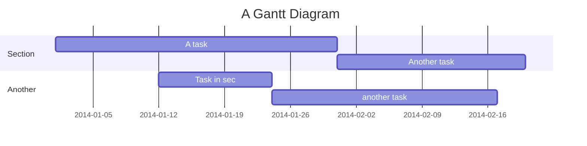

# Mermaid: Gantt

## Mermaid Code

[Mermaid Live Editor: Gantt](https://mermaid.live/edit#pako:eNpdkcFuwyAMhl_F8jmtgIbQcKtWbaeetsumXFChadQGKupI26q--6BJV20WEtj-P_8CLrgN1qHG1niixkMK6ujoYAUvuQTrzrTR9GPLGnLPIfaGAN5TzDab2Xo99s5uS13w8DruY3EFZM4HeIQ2vADBeDljPK0CFsxOUh9o7-ID0GZHKTccICP2r80kH4tvmel8bk42dwsuMs3FRJv_JqBBlBYLbGNnUVMcXIG9S1fMKV4y1mBietegTkfrdmY4UoONvybsZPxHCP2djGFo96h35nhO2XDKDza94K_EeeviUxg8oRZLcZuB-oKfqKWcL1VZKy64VGVVVwV-ZZGaLyomhWBqsaxreS3w-2bKklyyFKJiSjEh0zRnOwpxM37r7XevPz9xjB8)

```
gantt
    title A Gantt Diagram
    dateFormat  YYYY-MM-DD
    section Section
    A task           :a1, 2014-01-01, 30d
    Another task     :after a1  , 20d
    section Another
    Task in sec      :2014-01-12  , 12d
    another task      : 24d
```

## Mermaid Diagram


