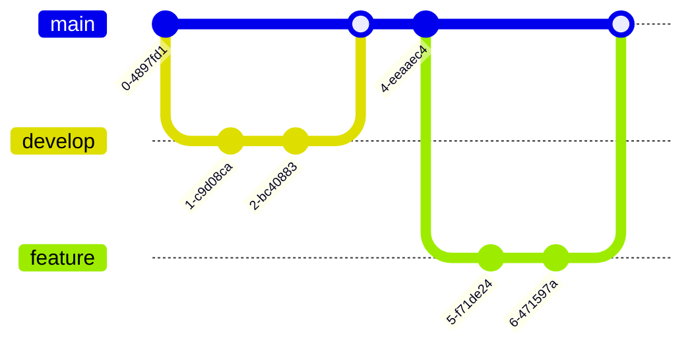

# Mermaid: Git

## Mermaid Code

[Mermaid Live Editor: Git](https://mermaid.live/edit#pako:eNqVUc1OxCAQfpXNnJuGLVK2XNfEky9gesEyLcQCDYJRm7672Haju4kH5_T9zhxmhs4rBAGDiQ9BTrp1hzydt9bEDT8H6Tp9UPiGo592X2P34lO8UX-1rvAlbaVxm2QxDPh3e7_Zo4wp4M2Wa_W_N_c2FDAEo0DEkLCA7OVgpjB_h1uIGi22IDJU2Ms0xhZat-TaJN2T9_bSDD4NGkQvx9fM0qRkxHsjhyB_IugUhrNPLoKomrt1B4gZ3jOlpKybmleEUsYYJdn9AHHkvOS0oYyeKs6OhC0FfK5XSXnijOSpasI5qVgBqEz04XF75PrP5QvaZpX9)

[Mermaid Documentation: Gitgraph](https://mermaid.js.org/syntax/gitgraph.html)

```
gitGraph
    commit
    branch develop
    checkout develop
    commit
    commit
    checkout main
    merge develop
    commit
    branch feature
    checkout feature
    commit
    commit
    checkout main
    merge feature
```

## Mermaid Diagram


