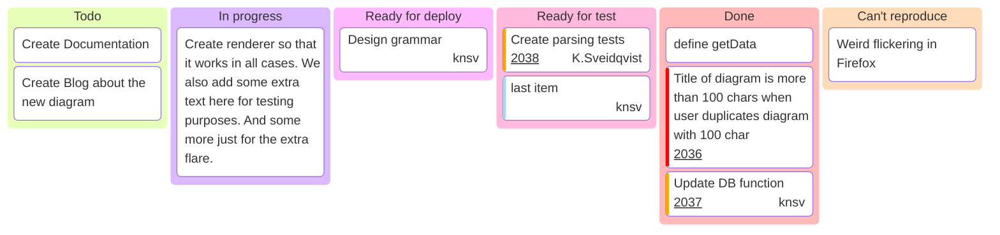

# Mermaid: Kanban

## Mermaid Code

[Mermaid Live Editor: Kanban](https://mermaid.live/edit#pako:eNp1VE1zmzAQ_Ss7ysEXYhtsg82pjd1OM2kvrdPMFOegoAUUg0T1Ecf1-L9XgE3drwtI7NunfW9XHEgqGZKYXF9fb0QqRcbzeCMAtlQ8UdEuAQxPt2huqMZ7VcYwKIypdTwa5dwU9mmYympUoaooZ9fP-rwcca0t6tHV-nZ59259NdiI9pCOuSFeSya7A5KlQmoQVjK1FQpDDZfisYsxmepz_KaUOdAnaQ2YAkHgDhinuaJVC05uBdRK5gq1PmVzFp6TFQqGChVo6bKpAW5gJ9VWAxdAyxJSJ1AP4QHdzmEoYw5aIeCrURSMe0HhCCCTyu204SKH2qpatmlvxQleSYd5ttp0wOJMkJVU4bCti7NF8hkp27cQhnUp933B82SFmucCGl0VVY9vDkB18wWZM38r9MsAjh2NP77gaWrqWaZn2TVVuqm0ieqGq-tmDMF4Mvcume-GX16Qs-8vXJuB55zkUnGzd5EPPC9OZ7aWhklJdWMgVg3jBfIrqj18lLuB9_-a_WQlBfaVzhKGGRcIOZoVNbQPBMmamxJBZucuA9edva5_AvzxGNLCyYNdgQKsdr1lti556nTrPmfnprTH_mFA6P1VfKu1lzpJ7mvWjuYNZFak7WD-zhFdSm2U_tu6k_ggWVIxMG4a3aQym_7yYZI8IFfMzUnDrZqeucF8zxVm8tWhiEdyxRmJjbLokdM1c3f30DBsiJu0CjckdktnKLWl2ZCNOLq0mopvUlbnTCVtXpA4c1PudrbVt-rM6iHtXVlKKwyJJ0HYcpD4QF5JHEyGE9-fLqJxNIv8YDz1yJ7E06k_jKJFGPrhwp-HURAePfKjPXU8DMPpdD4LJkE0my3c0yPIuJHqU_fzaf9Bx5_thoNd)

```
---
config:
  kanban:
    ticketBaseUrl: 'https://github.com/mermaid-js/mermaid/issues/#TICKET#'
---
kanban
  Todo
    [Create Documentation]
    docs[Create Blog about the new diagram]
  [In progress]
    id6[Create renderer so that it works in all cases. We also add some extra text here for testing purposes. And some more just for the extra flare.]
  id9[Ready for deploy]
    id8[Design grammar]@{ assigned: 'knsv' }
  id10[Ready for test]
    id4[Create parsing tests]@{ ticket: 2038, assigned: 'K.Sveidqvist', priority: 'High' }
    id66[last item]@{ priority: 'Very Low', assigned: 'knsv' }
  id11[Done]
    id5[define getData]
    id2[Title of diagram is more than 100 chars when user duplicates diagram with 100 char]@{ ticket: 2036, priority: 'Very High'}
    id3[Update DB function]@{ ticket: 2037, assigned: knsv, priority: 'High' }

  id12[Can't reproduce]
    id3[Weird flickering in Firefox]
```

## Mermaid Diagram


