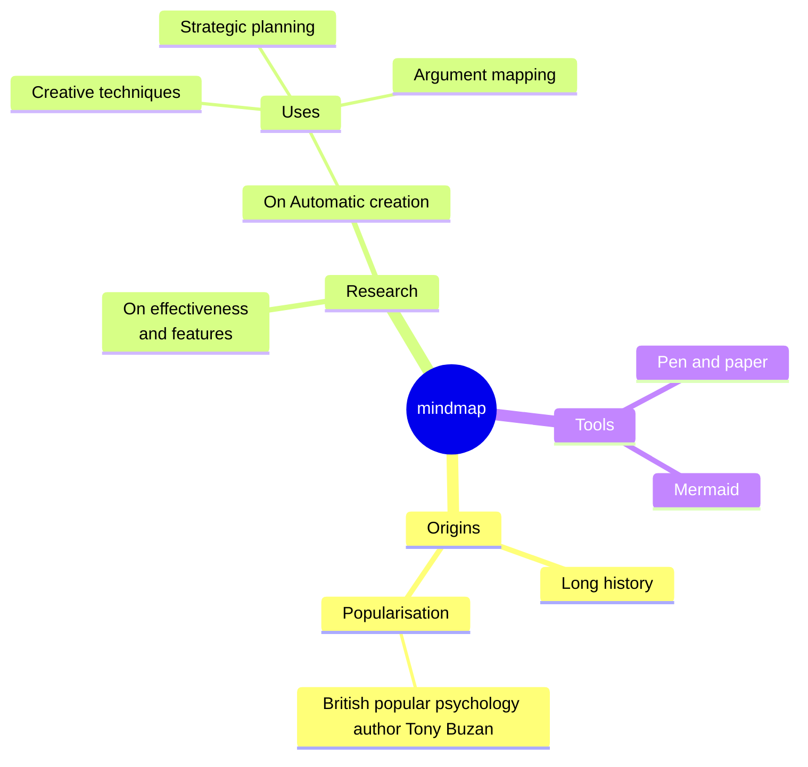

# Mermaid: Mindmap

## Mermaid Code

[Mermaid Live Editor: Mindmap](https://mermaid.live/edit#pako:eNpdUstu2zAQ_JUFTzbgurIkWzYRFEjSY4MEbXopdGGklURU2mX5CKoY_vfSDyVN9kLuzOxwQOxeVFyjkGLQVA_KlARgmf1sdgHm8yMEcG91q8mdG4BvTC102nm244RJqSumWaOgUZ-emH_PJ-aBTeiV1U55zTShADdWe-06MGcejBurjntuR1DBd2zhkWmEm_CiLlPf0aGyVTd53BNg02Dl9TMSOnf1ZD9_UVRDg8oHi-4_4XXwPMQEFVQWPyT56d6k57o9aZ4RPFYd6T_ho-CHt8pjG-1Mr4g0te_5a9uGAclD_EXzyj4y969GD0hwDGuUQTuBd2gHpWuxEK2Nh_Q24EIMF1SK_VFYCt_hgKWQ8Vpjo0LvS1HSIY4ZRb-Yh2nScmg7IRvVu9gFU8fUX7VqrXqTINVobzmQF3JVnCyE3Iu_scu3yzzLk2Sd5bssyyI5Cpltlmm6S1a71brYpFm6zQ8L8XJ6NFlui3USK90kRZGk64XAWsc9uTsv2mnfDv8AItHDjw)

[Mermaid Documentation: Mindmap](https://mermaid.js.org/syntax/mindmap.html)

```
mindmap
  root((mindmap))
    Origins
      Long history
      ::icon(fa fa-book)
      Popularisation
        British popular psychology author Tony Buzan
    Research
      On effectiveness<br/>and features
      On Automatic creation
        Uses
            Creative techniques
            Strategic planning
            Argument mapping
    Tools
      Pen and paper
      Mermaid
```

## Mermaid Diagram


