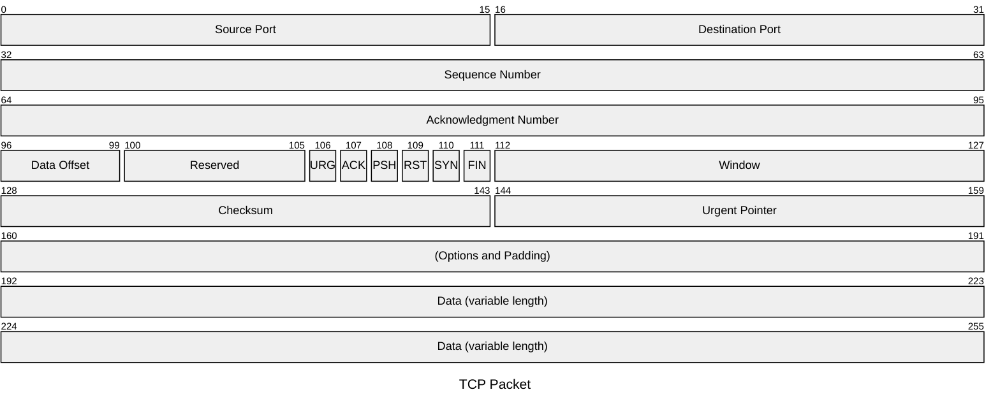

# Mermaid: Packet

## Mermaid Code

[Mermaid Live Editor: Packet](https://mermaid.live/edit#pako:eNpNks1u2zAQhF9F4CkBzECU9WPpFjhoExRNBDtB0UAXRlzLhCXSpcikreF3L7ls0xy_3Znh7oIn0msBpCGU0k5ZaUdoko48rtuk5f0BbEc6hb1jRJVSVgTJVjvTQ9JqgxpW0iUL9RuYrVTcSq3em8uMlks0wQ8Hytvu3fQCJvTKnNYYeN0flH4bQQwTKPtBUZe0rjGaW5487HZzHIulfpYUvRuYwbyCiOUylJ42nyNVGL7-EmkVqN3eRsLYzfYRiaU44vf7SLjNp7u_lFGWYdI3qYR-w2K2oizHvdZ76A-zm7Cc5_5EmPxkhrBKq6WycRdW-plrjL54OIYjzQlXwh9bCKmGS9TUGc2K4n3ji1duJH8ZIRlBDXbvRWRBBiMFaaxxsCATmIkHJKdOJd5n9zBBR0KEgB13Ix7s7G1Hrp61nv45jXbDnjQ7Ps6e3FFwCzeSD4b_l4ASYNbaKUuaAhNIcyI_PRRXqyqvK5axosrL2jd_kcbvfuWpStNl5u_NyuK8IL_xzdTrvQiEtNp8jR8P_9_5D5TTw48)

[Mermaid Documentation: Packet Diagram](https://mermaid.js.org/syntax/packet.html)

```
---
title: "TCP Packet"
---
packet
0-15: "Source Port"
16-31: "Destination Port"
32-63: "Sequence Number"
64-95: "Acknowledgment Number"
96-99: "Data Offset"
100-105: "Reserved"
106: "URG"
107: "ACK"
108: "PSH"
109: "RST"
110: "SYN"
111: "FIN"
112-127: "Window"
128-143: "Checksum"
144-159: "Urgent Pointer"
160-191: "(Options and Padding)"
192-255: "Data (variable length)"
```

## Mermaid Diagram


