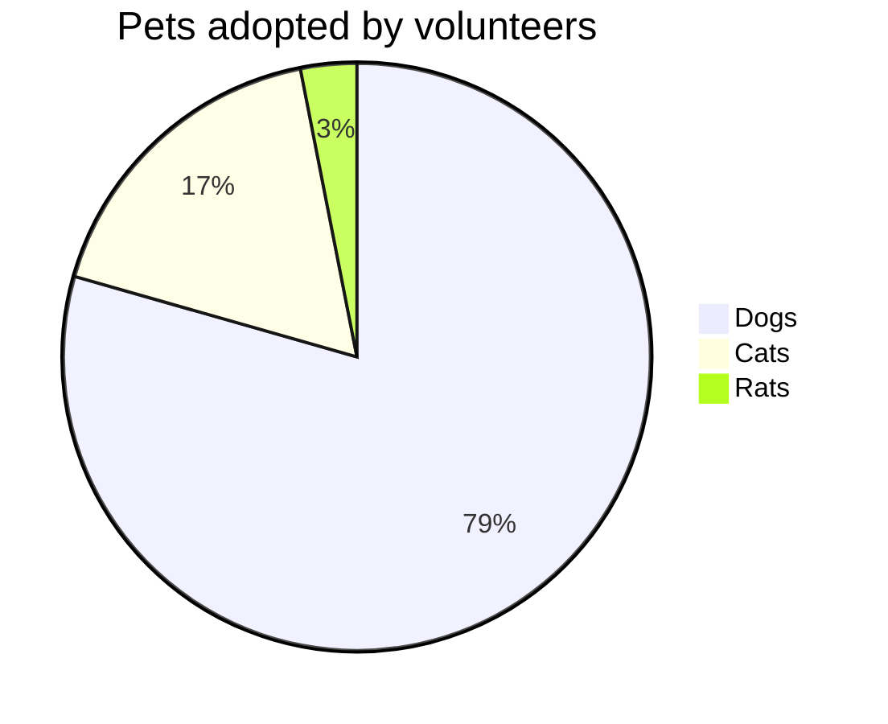

# Mermaid: Pie

## Mermaid Code

[Mermaid Live Editor: Pie](https://mermaid.live/edit#pako:eNpFUEFugzAQ_Iq1Z4QM2Nj1NblWqnKsfHHrDUECG5klaor4ex0i1DntjGZ2V7PCd_QIBqYeGfU0IPtAmpnzcSL07OvB7nFYAiGm2QaWYeEcu9kCM6zR7aGdHL00LQ_pckiVhAK61HswlBYsYMQ0uieF9Wm2QDcc0YLJo8erWwayYMOWY5MLnzGORzLFpbuBubphzmyZvCM8965L7t-CwWM6xfw0mErtK8Cs8JMZl2XLeVM1omq1EkoU8AAjeFnV4k3XXHKpdCO2An73o7zUSvKMuuVK8VrWBaDvKab3V217e9sfTYlhWA))

```
pie title Pets adopted by volunteers
    "Dogs" : 386
    "Cats" : 85
    "Rats" : 15
```

## Mermaid Diagram


