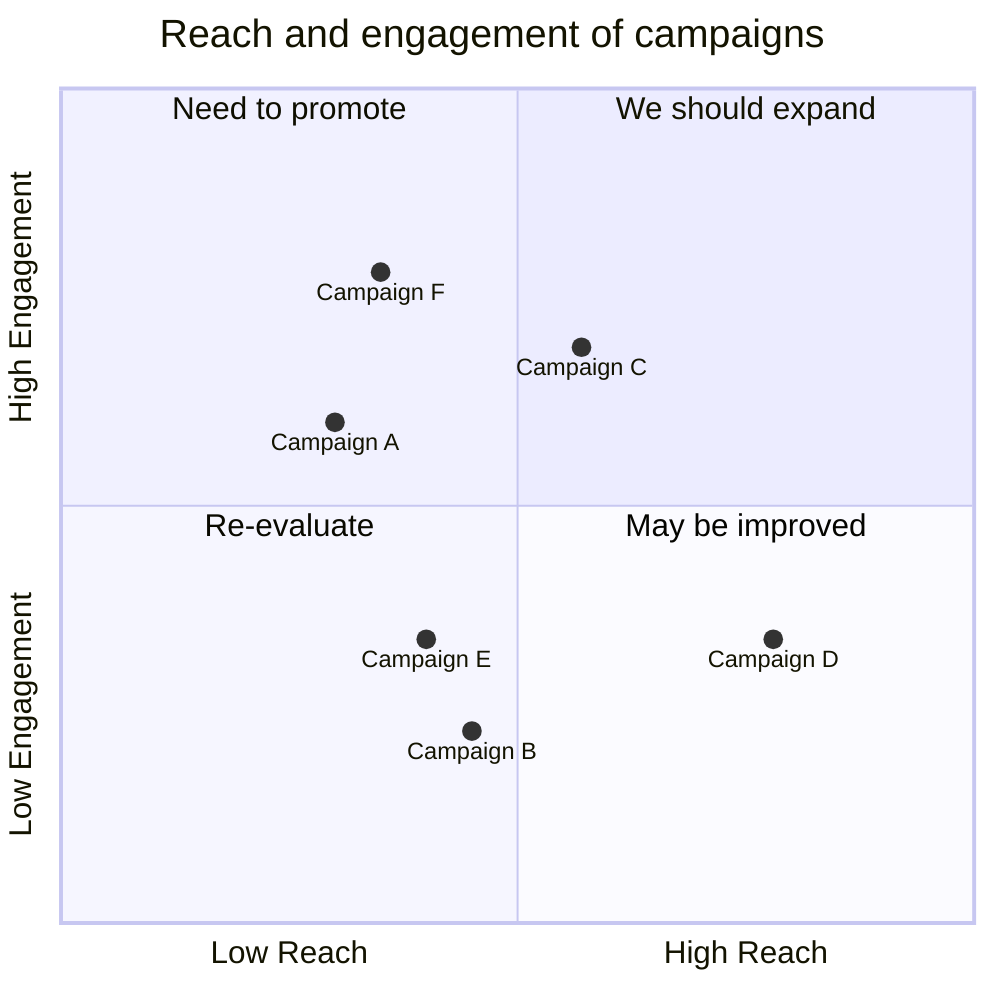

# Mermaid: Quadrant

## Mermaid Code

[Mermaid Live Editor: Quadrant](https://mermaid.live/edit#pako:eNptks1O6zAQhV9lNOukcv6a4gUSFBCLC4u7uRKExVBPk0iJXVyH21L13XGSQqWAVx5_54yPRz7gyihGiW8dKUvaLSuyrtDgl6tdw_CXaVUBaQWsSyq5Ze3ArGFF7YbqUm9H8S6kXb2FP-b_yRGGl3Bfl9VYjqL9WXR7bvatPJ-N8q9MYQT_GLaV6RqfYrfxYSaCGB6ZFTgDG2ta43jCE58i5HdqOvrBUnigPbwy1K03v_Op9_L0PriS8CxmSQBiNn-ZsOuBpVkP42RKlwPN8sF6MaU3A80XPU3SKb0dO4vf6d2Yabg3X7xggKWtFUpnOw6wZdtSX-Kh9xXoKj_VAqXfKl5T17gCC330Nj_LJ2PaL6c1XVmhXFOz9VW3UX5cNzWVls4S1ort0nTaofQJ-hYoD7hDGaXZLIrTi4VIo3kksiwJcI8yTSanxwA_hkvFbJFnwq94LvJcxFkcIKvaGfsw_srhcx4_AYU6zUg)

[Mermaid Documentation: Quadrant Chart](https://mermaid.js.org/syntax/quadrantChart.html)

```
quadrantChart
    title Reach and engagement of campaigns
    x-axis Low Reach --> High Reach
    y-axis Low Engagement --> High Engagement
    quadrant-1 We should expand
    quadrant-2 Need to promote
    quadrant-3 Re-evaluate
    quadrant-4 May be improved
    Campaign A: [0.3, 0.6]
    Campaign B: [0.45, 0.23]
    Campaign C: [0.57, 0.69]
    Campaign D: [0.78, 0.34]
    Campaign E: [0.40, 0.34]
    Campaign F: [0.35, 0.78]
```

## Mermaid Diagram


