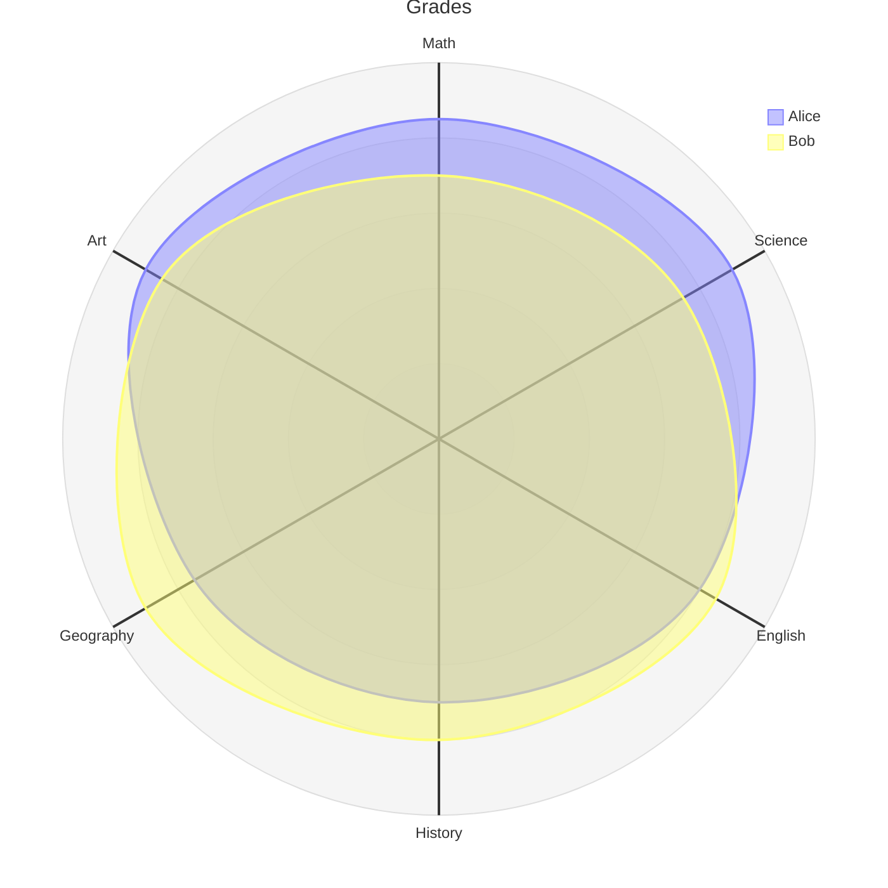

# Mermaid: Radar

## Mermaid Code

[Mermaid Live Editor: Radar](https://mermaid.live/edit#pako:eNpVkc1uwyAQhF8F7RlHdhIHx7f-Kb3k1FtLD8Te2Eg2RBhXSS2_exfSNCoSEjN8s8AyQWVrhBKSJJHGa99hySTsnKpxkCBN9EkplxzQK2kYU2c9sP5Dwl75VsInZwOJt0qjqTBqJP1imk4PYf8v05L9qgdv3SViDekd2capU3t1FDkPzv-GqtF94dXrdCw9FTln25SzgqYIM-r5Th-IfrSHwN72QybwMZcTG-henVmWpnGpDaMFcGicrqH0bkQOPbpeBQlTgCT4Fnu6Q2hPjUc1dj70Z6bYSZl3a_tb0tmxaaE8qm4gNZ5q5fFZK3rmHUFTo3uyo_FQrkUsAeUEZyizdb7IluutEKJYbTd5weFCzOqfKUQ-c_iOh6aLQuQpjeUmFSJd5hkHrDV1eX_92vjD8w-xGpPB)

[Mermaid Documentation: Radar Chart](https://mermaid.js.org/syntax/radar.html)

```
---
title: "Grades"
---
radar-beta
  axis m["Math"], s["Science"], e["English"]
  axis h["History"], g["Geography"], a["Art"]
  curve a["Alice"]{85, 90, 80, 70, 75, 90}
  curve b["Bob"]{70, 75, 85, 80, 90, 85}

  max 100
  min 0
```

## Mermaid Diagram


