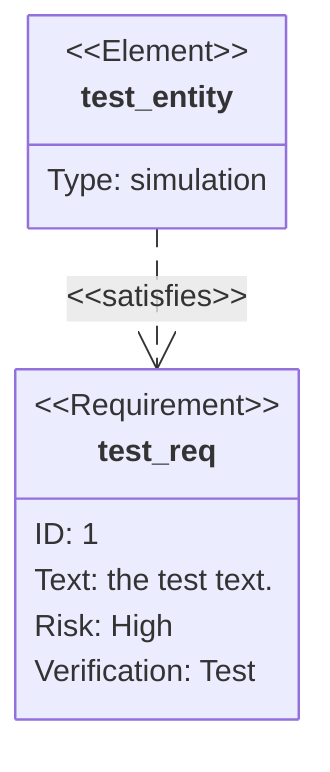

# Mermaid: Requirement

## Mermaid Code

[Mermaid Live Editor: Requirement](https://mermaid.live/edit#pako:eNpdUUFuwyAQ_Aras2PFcRwSDr20136gslShsrZRDLiwVHEt_73ETqKonGZ2Z3aAneDLKQQBHr-j9mjQ0puWrZemtrVl6Tx1GGGgz1Rg09rTSrBihYQXEow6XEQLzW8DdDgL1um2W_kPet2MBqlzyX5Vr_X5noj9U1oCmsZ7II0DCha0ib0k7ew_57Njw0KShEZjYJuXx9Uhg9ZrBYJ8xAwMeiOvFJaEGtILDNYgElTYyNhTDbWdk22Q9sM5c3d6F9sORCP7kFgclCS8fd1Dglahf3XREohqmQBigguIsijyoiyO23K7q6rTIYMRxL7Mi93-xDk_lqdDxfmcwe-SuM2PPPlRaXL-fd3Ysrj5D652kfs)

```
requirementDiagram

    requirement test_req {
    id: 1
    text: the test text.
    risk: high
    verifymethod: test
    }

    element test_entity {
    type: simulation
    }

    test_entity - satisfies -> test_req
```

## Mermaid Diagram


