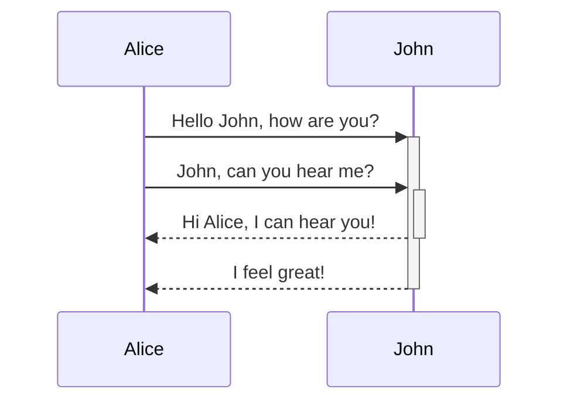

# Mermaid: Sequence

## Mermaid Code

[Mermaid Live Editor: Sequence](https://mermaid.live/edit#pako:eNptkc1OwzAMgF8l85V06s_atDkMITgwJF4A9RI17o-UJiNLBKPqu5O2jNN8sGz5-xwpnqAxEoHDBT896gZfBtFZMdaahHhSQ4PR8fjwZnrNySsqZchSU9KbLyIskqvxj3fhDWuEXhDSo7BkxD90mUUBjVYnLB42m5LTaqx00Hb38RNpERXpLAq3AwqdHSRwZz1SGNGOYmlhWuQaXI8j1sBDKbEVXrkaaj0H7Sz0hzHjzbTGdz3wVqhL6PxZCnf7jX8EtUT7bLx2wNP4sO4APsE38KRM94yleZHnVRKXWcUoXIFHRbYvU1bkISVpmSfVTOFnfTbZH4qsDIO0YHEwWU4B5eCMfd9usp5m_gVI_n_9)

```
sequenceDiagram
    Alice->>+John: Hello John, how are you?
    Alice->>+John: John, can you hear me?
    John-->>-Alice: Hi Alice, I can hear you!
    John-->>-Alice: I feel great!
```

## Mermaid Diagram


