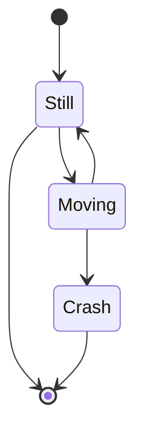

# Mermaid: State

## Mermaid Code

[Mermaid Live Editor: State](https://mermaid.live/edit#pako:eNpdkDFvwyAQhf-KdWNlWxjjUBi6pGumbK07oEJsJBsiDFFay_-9BJS2yk3vvnfvELfCp5UKOCxeePWqxeDEXF1wb4pY708fRVW9FEevpymjJBOM5iM62Is2Q6ZZP8b_0b0Ty5hpkvelUMLgtATuXVAlzMrN4tbCehvuwY9qVj3wKKU6iTD5HnqzxdhZmDdr53vS2TCMwE9iWmIXzvLvh78jykjl9jYYD7yhaQXwFa7AW4ZqRlnTEkpY25FddL-AE1Q3mESjxYxghtqthO_0KKqfaYdi4R2iFOGOlKCk9tYd8onTpbcfC21t2A)

```
stateDiagram-v2
    [*] --> Still
    Still --> [*]
    Still --> Moving
    Moving --> Still
    Moving --> Crash
    Crash --> [*]
```

## Mermaid Diagram


