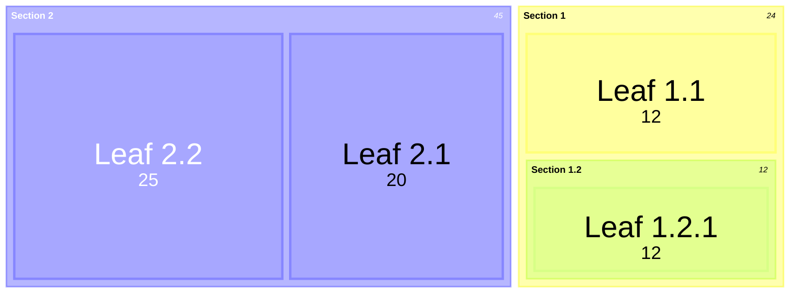

# Mermaid: Treemap

## Mermaid Code

[Mermaid Live Editor: Treemap](https://mermaid.live/edit#pako:eNpdkL1OxDAQhF8l2jpEXl-cH7dHCRUdcmPOm1yksx0ZRwKivDtOIATddjP6ZlaaGS7eEEiIgcjq8eGNolZOwQtd4uBdhgqUy9IpeCLdZVgkR2bId_cPLPiO_oP5gR8ov-v8hTi7c_nmCsihD4MBGcNEOVgKVq8S5pVXEK9kaUUVGOr0dItr_5Jio3av3ts9GfzUX0F2-vae1DQaHelx0H3QB0LOUDj7yUWQJW4VIGf4ACnK4sRKbPHUYiUQ2xw-QWLdFMhK3qBoGy5KXi05fG1PWdHUgqXjFatrxkWqIzNEH55_Nt-mX74Bmptu-g)

```
treemap-beta
"Section 1"
    "Leaf 1.1": 12
    "Section 1.2"
      "Leaf 1.2.1": 12
"Section 2"
    "Leaf 2.1": 20
    "Leaf 2.2": 25
```

## Mermaid Diagram


