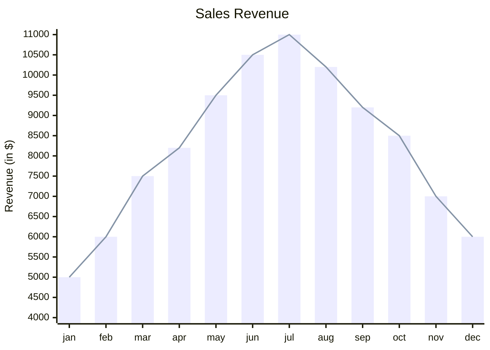

# Mermaid: XY

## Mermaid Code

[Mermaid Live Editor: XY](https://mermaid.live/edit#pako:eNqtUk1vgzAM_SuWtcMmhSogIMBhl-26y3Zb2SEFl1JBQCGpYFX_-xLYxx9YDi9-8fNzZPmK1VATFjgv1UlqExzIyFKBO6Y1HUGJb7KjCV7pQspSiVtyDuTcTrA_S8XgSAcGvdQM5Kh9tDA4W-Whc2-2YTDRyGCoDAM1XBjUVH1sRstmVOJ3A7hvFdw9lAgx5xyC4BHC0EWb-iA17BNHGaQrisRjFnnM1zjk2xXyjW2pFbM1I37Lv7_QtYr-0xUZNrqtsTDaEsOedC89xavvV6I5Ue8GWbiwpqO0nfFTvbmyUar3Yeh_KvVgmxMWR9lNjtmxloaeW9lo-SchVZN-GqwyWKTJaoHFFWcskmSXiTgXYRQmIk7zOGW4eNEujeI8CzORCBGLG8PPtSd3cj8EHqVcCB4lIUOqWzPol21F1k25fQF8-Je_)

```
xychart-beta
    title "Sales Revenue"
    x-axis [jan, feb, mar, apr, may, jun, jul, aug, sep, oct, nov, dec]
    y-axis "Revenue (in $)" 4000 --> 11000
    bar [5000, 6000, 7500, 8200, 9500, 10500, 11000, 10200, 9200, 8500, 7000, 6000]
    line [5000, 6000, 7500, 8200, 9500, 10500, 11000, 10200, 9200, 8500, 7000, 6000]
```

## Mermaid Diagram


